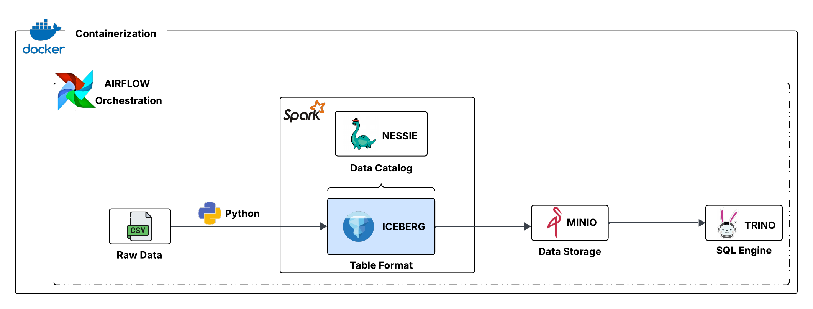

<!-- Improved compatibility of back to top link: See: https://github.com/othneildrew/Best-README-Template/pull/73 -->
<a id="readme-top"></a>
<!--
*** Thanks for checking out the Best-README-Template. If you have a suggestion
*** that would make this better, please fork the repo and create a pull request
*** or simply open an issue with the tag "enhancement".
*** Don't forget to give the project a star!
*** Thanks again! Now go create something AMAZING! :D
-->


<!-- PROJECT SHIELDS -->
<!--
*** I'm using markdown "reference style" links for readability.
*** Reference links are enclosed in brackets [ ] instead of parentheses ( ).
*** See the bottom of this document for the declaration of the reference variables
*** for contributors-url, forks-url, etc. This is an optional, concise syntax you may use.
*** https://www.markdownguide.org/basic-syntax/#reference-style-links
-->
<!-- [![LinkedIn][linkedin-shield]][linkedin-url]
[![Github][github-shield]][github-url] -->


<!-- ABOUT THE PROJECT -->
## A propos du projet

<!-- PROJECT LOGO -->
<br />
<div align="center">
  <a href="https://github.com/HansDoh2404/youtube_videos_2025_lakehouse.git">
    
  </a>
 
  <h3 align="center">youtube_videos_2025_lakehouse</h3>

  <!-- <p align="center">
    An awesome README template to jumpstart your projects!
    <br />
    <a href="https://github.com/othneildrew/Best-README-Template"><strong>Explore the docs »</strong></a>
    <br />
    <br />
    <a href="https://github.com/othneildrew/Best-README-Template">View Demo</a>
    &middot;
    <a href="https://github.com/othneildrew/Best-README-Template/issues/new?labels=bug&template=bug-report---.md">Report Bug</a>
    &middot;
    <a href="https://github.com/othneildrew/Best-README-Template/issues/new?labels=enhancement&template=feature-request---.md">Request Feature</a>
  </p> -->
</div>

Le projet mis en œuvre est un lakehouse. Son objectif est de faciliter le stockage, le traitement et l’analyse de données massives en suivant une approche ELT (Extract, Load, Transform). Cette architecture combine la scalabilité et la flexibilité de stockage d’un datalake avec les capacités de gestion et d’analyse traditionnelles d’un entrepôt de données (datawarehouse). Nous utilisons dans notre cas les données relatives aux vidéos issues des meilleures chaines Youtube de l'année 2025.


## Stack technologique

Les différents outils technologiques utilisés pour son implémentation sont les suivants

* [![Python][python]][python-url]
* [![Spark][spark]][spark-url]
* [![Nessie][nessie]][nessie-url]
* [![Minio][minio]][minio-url]
* [![Airflow][airflow]][airflow-url]
* [![Docker][docker]][docker-url]


<!-- GETTING STARTED -->
## Prérequis

Outils à installer avant de débuter

- **Python** : https://www.python.org/downloads/ 
- **Docker** : https://www.docker.com/get-started/


## Installation

1. Cloner le repo
   ```sh
   git clone https://github.com/HansDoh2404/youtube_videos_2025_lakehouse.git
   ```

2. Se déplacer dans :
   ```sh
   cd youtube_videos_2025_lakehouse
   ```

3. Après s'être assuré que docker-engine ou docker-desktop est lancé, exécuter :
   ```sh
   docker compose up -d
   ```

4. Accéder au conteneur spark et configurer le catalog nessie:
   ```sh
   docker exec -it spark-iceberg /bin/bash

   sudo apt update

   sudo apt install nano -y 

   sudo nano /opt/spark/conf/spark-defaults.conf

   -- copier coller le contenu suivant dans le 
   
    spark.sql.extensions                     org.apache.iceberg.spark.extensions.IcebergSparkSessionExtensions,org.projectnessie.spark.extensions.NessieSparkSessionExtensions
    spark.sql.catalog.nessie                 org.apache.iceberg.spark.SparkCatalog
    spark.sql.catalog.nessie.type            nessie
    spark.sql.catalog.nessie.uri             http://nessie:19120/api/v2
    spark.sql.catalog.nessie.ref             main
    spark.sql.catalog.nessie.io-impl         org.apache.iceberg.aws.s3.S3FileIO
    spark.sql.catalog.nessie.warehouse       s3://warehouse/wh/
    spark.sql.catalog.nessie.s3.endpoint     http://minio:9000
    spark.sql.defaultCatalog                 nessie
    spark.eventLog.enabled                   true
    spark.eventLog.dir                       /home/iceberg/spark-events
    spark.history.fs.logDirectory            /home/iceberg/spark-events
    spark.sql.catalogImplementation          in-memory
   ```

  *Se rendre vers http://localhost:8080 pour voir le bucket minio créé* 


5. Aller vers http://localhost:8083 pour exécuter le dag manuellement ou programmer son exécution via le code

<!-- CONTACT -->
## Contact

Contributeur : [@Hans Ariel](https://www.linkedin.com/in/hans-ariel-doh-59a31a2ba/) - hansearieldo@gmail.com
<br />
Lien du projet: https://github.com/HansDoh2404/youtube_videos_2025_lakehouse.git


<!-- ACKNOWLEDGMENTS -->
## Utiles

* [Shields.io](https://shields.io/) : pour créer les badges dynamiquement
* [Lucid App](https://lucid.app) : pour créer des diagrammes et architectures
* [Youtube Top Channel Videos (2025)](https://www.kaggle.com/datasets/xtitanixx/youtube-videos?resource=download) : dataset utilisé


<!-- MARKDOWN LINKS & IMAGES -->
[linkedin-shield]: https://img.shields.io/badge/linkedin-%230072B1?style=for-the-badge&logo=LinkedIn
[linkedin-url]: https://www.linkedin.com/in/hans-ariel-doh-59a31a2ba/
[github-shield]: https://img.shields.io/badge/github-black?style=for-the-badge
[github-url]: https://github.com/HansDoh2404
[python]: https://img.shields.io/badge/Python-blue?style=for-the-badge&logo=python&logoColor=white
[python-url]: https://docs.python.org/3/
[nessie]: https://img.shields.io/badge/Nessie-green?style=for-the-badge&logo=nesie&logoColor=white
[nessie-url]: https://docs.python.org/3/
[spark]: https://img.shields.io/badge/Spark-black?style=for-the-badge&logo=apache-spark
[spark-url]: https://spark.apache.org/
[minio]: https://img.shields.io/badge/minio-red?style=for-the-badge&logo=minio&logoColor=white
[minio-url]: https://docs.min.io/enterprise/aistor-object-store/
[airflow]: https://img.shields.io/badge/airflow-%2300338F?style=for-the-badge&logo=apache-airflow&logoColor=white
[airflow-url]: https://airflow.apache.org/docs/
[docker]: https://img.shields.io/badge/docker-%231D63ED?style=for-the-badge&logo=docker&logoColor=white
[docker-url]: https://docs.docker.com/